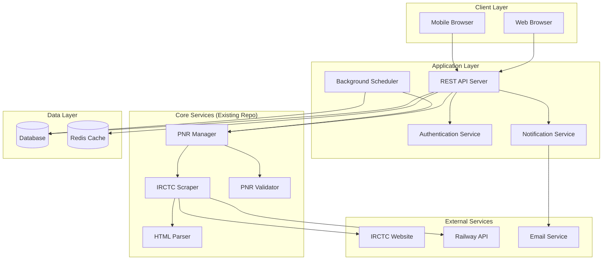

# Design Document

## Overview

The PNR Tracker Web Application transforms the existing CLI-based PNR checker into a full-featured web application. The design leverages the proven IRCTC scraping functionality, HTML parsing logic, and PNR management features from the existing repository while adding user authentication, persistent storage, real-time notifications, and a responsive web interface.

## Architecture

### High-Level Architecture



### Technology Stack

**Frontend:**
- React.js with TypeScript for type safety
- Material-UI or Tailwind CSS for responsive design
- PWA capabilities for mobile notifications
- WebSocket for real-time updates

**Backend:**
- Node.js with Express.js (consistent with existing repo)
- TypeScript for better maintainability
- JWT for authentication
- WebSocket.io for real-time communication

**Database:**
- PostgreSQL for user data and PNR tracking history
- Redis for caching and session management

**External Services:**
- Nodemailer for email notifications
- Web Push API for browser notifications

## Components and Interfaces

### 1. Core PNR Services (Adapted from Existing Repo)

#### PNR Scraper Service
```typescript
interface PNRScraperService {
  checkPNRStatus(pnr: string): Promise<PNRStatusResult>
  checkMultiplePNRs(pnrs: string[]): Promise<PNRStatusResult[]>
  validatePNR(pnr: string): boolean
}

interface PNRStatusResult {
  pnr: string
  from: string
  to: string
  date: string
  status: string
  isFlushed: boolean
  lastUpdated: Date
  error?: string
}
```

**Implementation Notes:**
- Adapts `checkPnrStatus.js` performRequest function
- Integrates `tools.js` validatePnr and HTML parsing logic
- Maintains existing CSS selectors from `defineSelectors.js`
- Preserves flushed PNR detection mechanism

#### HTML Parser Service
```typescript
interface HTMLParserService {
  parseIRCTCResponse(html: string): ParsedPNRData
  extractJourneyDetails(html: string): JourneyDetails
}

interface ParsedPNRData {
  journeyDetails: JourneyDetails[]
  flushedPNRs: string[]
  errors: string[]
}
```

**Implementation Notes:**
- Adapts `tools.js` getDataFromHtml function
- Uses existing jsdom and jQuery parsing logic
- Maintains CSS selector definitions for data extraction

### 2. User Management System (New Development)

#### User Service
```typescript
interface UserService {
  registerUser(userData: UserRegistration): Promise<User>
  authenticateUser(credentials: LoginCredentials): Promise<AuthResult>
  updateUserProfile(userId: string, updates: UserUpdate): Promise<User>
  resetPassword(email: string): Promise<void>
}

interface User {
  id: string
  email: string
  name: string
  notificationPreferences: NotificationSettings
  createdAt: Date
  lastLogin: Date
}
```

#### Authentication Service
```typescript
interface AuthService {
  generateJWT(user: User): string
  verifyJWT(token: string): Promise<User>
  refreshToken(refreshToken: string): Promise<string>
}
```

### 3. PNR Management System (Enhanced from Existing)

#### PNR Management Service
```typescript
interface PNRManagementService {
  addPNR(userId: string, pnr: string): Promise<TrackedPNR>
  removePNR(userId: string, pnrId: string): Promise<void>
  getUserPNRs(userId: string): Promise<TrackedPNR[]>
  updatePNRStatus(pnrId: string, status: PNRStatusResult): Promise<void>
}

interface TrackedPNR {
  id: string
  userId: string
  pnr: string
  currentStatus: PNRStatusResult
  statusHistory: PNRStatusHistory[]
  isActive: boolean
  createdAt: Date
}
```

**Implementation Notes:**
- Enhances existing `addPnr.js`, `getPnrs.js`, `deletePnrs.js` functionality
- Adds database persistence instead of Configstore
- Maintains PNR validation logic from existing repo

### 4. Notification System (New Development)

#### Notification Service
```typescript
interface NotificationService {
  sendStatusChangeNotification(user: User, pnr: TrackedPNR, oldStatus: string, newStatus: string): Promise<void>
  sendEmailNotification(email: string, subject: string, content: string): Promise<void>
  sendPushNotification(userId: string, notification: PushNotification): Promise<void>
  createInAppNotification(userId: string, notification: InAppNotification): Promise<void>
}

interface NotificationSettings {
  emailEnabled: boolean
  pushEnabled: boolean
  inAppEnabled: boolean
  statusTypes: string[] // ['confirmation', 'waitlist_movement', 'cancellation']
}
```

### 5. Background Scheduler (New Development)

#### Scheduler Service
```typescript
interface SchedulerService {
  scheduleStatusCheck(pnrId: string, interval: number): void
  cancelStatusCheck(pnrId: string): void
  processScheduledChecks(): Promise<void>
}
```

**Implementation Notes:**
- Uses node-cron for scheduling
- Adapts `checkAllPnrStatus.js` batch processing logic
- Implements intelligent scheduling based on travel dates

## Data Models

### Database Schema

#### Users Table
```sql
CREATE TABLE users (
  id UUID PRIMARY KEY DEFAULT gen_random_uuid(),
  email VARCHAR(255) UNIQUE NOT NULL,
  password_hash VARCHAR(255) NOT NULL,
  name VARCHAR(255) NOT NULL,
  notification_preferences JSONB DEFAULT '{}',
  created_at TIMESTAMP DEFAULT NOW(),
  updated_at TIMESTAMP DEFAULT NOW()
);
```

#### Tracked PNRs Table
```sql
CREATE TABLE tracked_pnrs (
  id UUID PRIMARY KEY DEFAULT gen_random_uuid(),
  user_id UUID REFERENCES users(id) ON DELETE CASCADE,
  pnr VARCHAR(10) NOT NULL,
  current_status JSONB NOT NULL,
  is_active BOOLEAN DEFAULT true,
  created_at TIMESTAMP DEFAULT NOW(),
  updated_at TIMESTAMP DEFAULT NOW(),
  UNIQUE(user_id, pnr)
);
```

#### PNR Status History Table
```sql
CREATE TABLE pnr_status_history (
  id UUID PRIMARY KEY DEFAULT gen_random_uuid(),
  tracked_pnr_id UUID REFERENCES tracked_pnrs(id) ON DELETE CASCADE,
  status_data JSONB NOT NULL,
  checked_at TIMESTAMP DEFAULT NOW(),
  status_changed BOOLEAN DEFAULT false
);
```

#### Notifications Table
```sql
CREATE TABLE notifications (
  id UUID PRIMARY KEY DEFAULT gen_random_uuid(),
  user_id UUID REFERENCES users(id) ON DELETE CASCADE,
  type VARCHAR(50) NOT NULL,
  title VARCHAR(255) NOT NULL,
  content TEXT NOT NULL,
  is_read BOOLEAN DEFAULT false,
  created_at TIMESTAMP DEFAULT NOW()
);
```

## Error Handling

### Error Categories and Responses

1. **IRCTC Scraping Errors**
   - Network timeouts: Retry with exponential backoff
   - HTML parsing failures: Log error, use cached data
   - Rate limiting: Implement request throttling
   - Maintenance windows: Display maintenance message

2. **Authentication Errors**
   - Invalid credentials: Return 401 with clear message
   - Expired tokens: Trigger token refresh flow
   - Account lockout: Implement progressive delays

3. **PNR Validation Errors**
   - Invalid format: Return validation error immediately
   - Flushed PNRs: Notify user and suggest removal
   - Duplicate PNRs: Prevent addition with clear message

4. **Notification Errors**
   - Email delivery failures: Retry and log for admin review
   - Push notification failures: Fall back to in-app notifications
   - Service unavailability: Queue notifications for retry

### Error Recovery Strategies

```typescript
interface ErrorRecoveryService {
  handleScrapingError(error: ScrapingError, pnr: string): Promise<ErrorRecoveryResult>
  handleNotificationError(error: NotificationError, notification: Notification): Promise<void>
  handleDatabaseError(error: DatabaseError, operation: string): Promise<void>
}
```

## Testing Strategy

### Unit Testing
- **Existing Logic**: Test adapted functions from original repo
  - PNR validation (`tools.js` validatePnr)
  - HTML parsing (`tools.js` getDataFromHtml)
  - Request handling (`checkPnrStatus.js` performRequest)
- **New Components**: Test all new services and API endpoints
- **Coverage Target**: 80% minimum for critical paths

### Integration Testing
- **IRCTC Scraping**: Test with mock HTML responses
- **Database Operations**: Test with test database
- **Authentication Flow**: Test JWT generation and validation
- **Notification Delivery**: Test with mock email/push services

### End-to-End Testing
- **User Registration and Login**: Complete authentication flow
- **PNR Management**: Add, track, and remove PNRs
- **Status Updates**: Verify status change detection and notifications
- **Mobile Responsiveness**: Test across different screen sizes

### Performance Testing
- **Concurrent Users**: Test with multiple simultaneous users
- **Batch Processing**: Test with large numbers of PNRs
- **Database Performance**: Test query performance under load
- **Scraping Rate Limits**: Test IRCTC request throttling

## Security Considerations

### Authentication Security
- Password hashing with bcrypt (minimum 12 rounds)
- JWT with short expiration times (15 minutes access, 7 days refresh)
- Rate limiting on authentication endpoints
- Account lockout after failed attempts

### Data Protection
- Encrypt sensitive data at rest
- Use HTTPS for all communications
- Sanitize all user inputs
- Implement CORS policies

### PNR Data Security
- PNR numbers are sensitive travel information
- Implement user data isolation
- Audit logs for PNR access
- Secure deletion of expired PNRs

### IRCTC Scraping Ethics
- Respect robots.txt and rate limits
- Implement request throttling
- Use appropriate user agents
- Handle maintenance windows gracefully